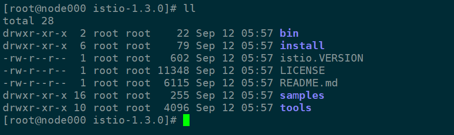
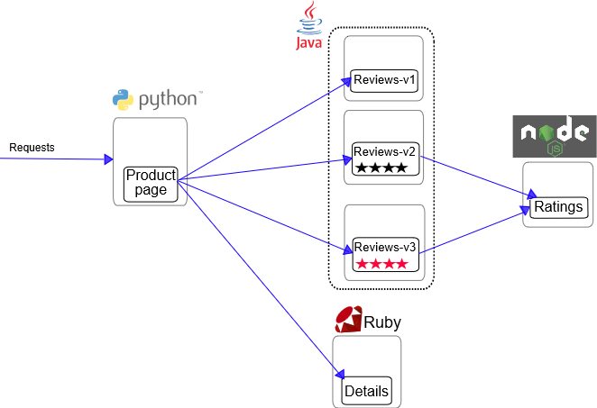
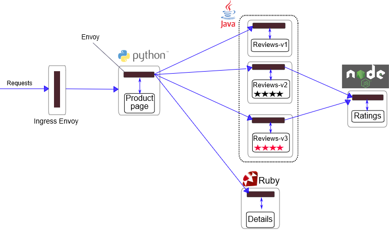

```
Istio 1.3 has been tested with these Kubernetes releases: 1.13, 1.14, 1.15.
```


# Evaluation install
## Prerequisites

```
curl -L https://git.io/getLatestIstio | ISTIO_VERSION=1.3.0 sh -

```

```
cd  istio-1.3.0
```




***code tree***

The installation directory contains:

*   Installation YAML files for Kubernetes in `install/kubernetes`
*   Sample applications in `samples/`
*   The [`istioctl`]((/docs/reference/commands/istioctl) client binary in the `bin/` directory. `istioctl` is used when manually injecting Envoy as a sidecar proxy.

```
.
├── bin
│   └── istioctl
├── install
│   ├── consul
│   ├── gcp
│   ├── kubernetes
│   ├── README.md
│   └── tools
├── istio.VERSION
├── LICENSE
├── README.md
├── samples
│   ├── bookinfo
│   ├── certs
│   ├── custom-bootstrap
│   ├── external
│   ├── fortio
│   ├── health-check
│   ├── helloworld
│   ├── httpbin
│   ├── https
│   ├── kubernetes-blog
│   ├── rawvm
│   ├── README.md
│   ├── sleep
│   ├── tcp-echo
│   └── websockets
└── tools
    ├── cache_buster.yaml
    ├── checker
    ├── convert_perf_results.py
    ├── convert_RbacConfig_to_ClusterRbacConfig.sh
    ├── docker-dev
    ├── dump_kubernetes.sh
    ├── githubContrib
    ├── hyperistio
    ├── _istioctl
    ├── istioctl.bash
    ├── istio-docker.mk
    ├── istio-iptables
    ├── license
    ├── packaging
    ├── perf_istio_rules.yaml
    ├── perf_k8svcs.yaml
    ├── perf_setup.svg
    ├── README.md
    ├── rules.yml
    ├── run_canonical_perf_tests.sh
    ├── setup_perf_cluster.sh
    ├── setup_run
    ├── update_all
    └── vagrant

30 directories, 22 files

```

install and config istioctl 


```
cp bin/istioctl  /usr/local/bin/

```

```
cp tools/istioctl.bash  ~/

```

 
```

vim ~/.bashrc 

add :

[[ -r "/usr/local/etc/profile.d/bash_completion.sh" ]] && . "/usr/local/etc/profile.d/bash_completion.sh"

source ~/istioctl.bash


then:
source  ~/.bashrc 

```


```
Istio configuration command line utility for service operators to
debug and diagnose their Istio mesh.

Usage:
  istioctl [command]

Available Commands:
  auth            (auth is experimental.  Use `istioctl experimental auth`)
  authn           Interact with Istio authentication policies
  convert-ingress Convert Ingress configuration into Istio VirtualService configuration
  dashboard       Access to Istio web UIs
  deregister      De-registers a service instance
  experimental    Experimental commands that may be modified or deprecated
  help            Help about any command
  kube-inject     Inject Envoy sidecar into Kubernetes pod resources
  proxy-config    Retrieve information about proxy configuration from Envoy [kube only]
  proxy-status    Retrieves the synchronization status of each Envoy in the mesh [kube only]
  register        Registers a service instance (e.g. VM) joining the mesh
  validate        Validate Istio policy and rules
  verify-install  Verifies Istio Installation Status or performs pre-check for the cluster before Istio installation
  version         Prints out build version information

Flags:
      --context string            The name of the kubeconfig context to use
  -h, --help                      help for istioctl
  -i, --istioNamespace string     Istio system namespace (default "istio-system")
  -c, --kubeconfig string         Kubernetes configuration file
      --log_output_level string   Comma-separated minimum per-scope logging level of messages to output, in the form of <scope>:<level>,<scope>:<level>,... where scope can be one of [ads, all, attributes, authn, default, grpcAdapter, kube-converter, mcp, meshconfig, model, name, patch, rbac, tpath, translator, util, validation] and level can be one of [debug, info, warn, error, fatal, none] (default "default:info")
  -n, --namespace string          Config namespace

Use "istioctl [command] --help" for more information about a command.

```


## Installation steps


```
for i in install/kubernetes/helm/istio-init/files/crd*yaml; do kubectl apply -f $i; done

```


```
kubectl apply -f install/kubernetes/istio-demo.yaml

```


## Verifying the installation

```
kubectl get svc -n istio-system

```

```
kubectl get pods -n istio-system

```
## Deploy your application  -  Bookinfo Application

# Bookinfo Application








### Start the application services

```
cd ~/istio-1.3.0
```

```
kubectl label namespace default istio-injection=enabled

```

```
kubectl apply -f samples/bookinfo/platform/kube/bookinfo.yaml

```

```
k get svc,po
```

```
kubectl exec -it $(kubectl get pod -l app=ratings -o jsonpath='{.items[0].metadata.name}') -c ratings -- curl productpage:9080/productpage | grep -o "<title>.*</title>"

```
### Determine the ingress IP and port

```
kubectl apply -f samples/bookinfo/networking/bookinfo-gateway.yaml

```

```
kubectl get gateway

```

```
kubectl get svc istio-ingressgateway -n istio-system


export INGRESS_HOST=$(kubectl get po -l istio=ingressgateway -n istio-system -o jsonpath='{.items[0].status.hostIP}')


export INGRESS_PORT=$(kubectl -n istio-system get service istio-ingressgateway -o jsonpath='{.spec.ports[?(@.name=="http2")].nodePort}')
export SECURE_INGRESS_PORT=$(kubectl -n istio-system get service istio-ingressgateway -o jsonpath='{.spec.ports[?(@.name=="https")].nodePort}')


export GATEWAY_URL=$INGRESS_HOST:$INGRESS_PORT

echo $GATEWAY_URL
```

## Confirm the app is accessible from outside the cluster


```
curl -s http://${GATEWAY_URL}/productpage | grep -o "<title>.*</title>"

```

## Apply default destination rules

```
kubectl apply -f samples/bookinfo/networking/destination-rule-all-mtls.yaml

```
check:


```
kubectl get destinationrules -o yaml

```


